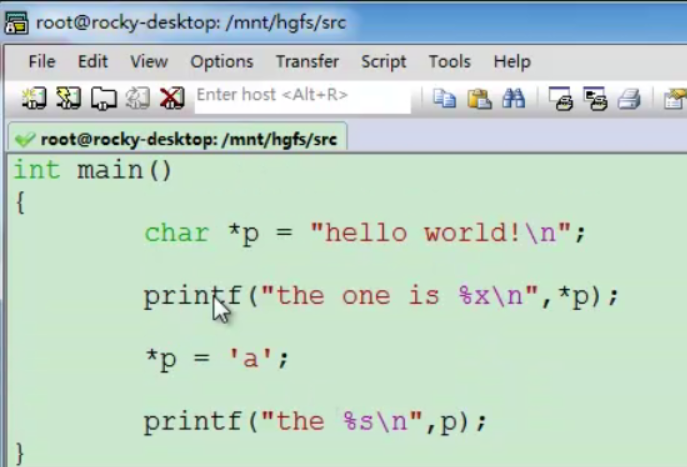
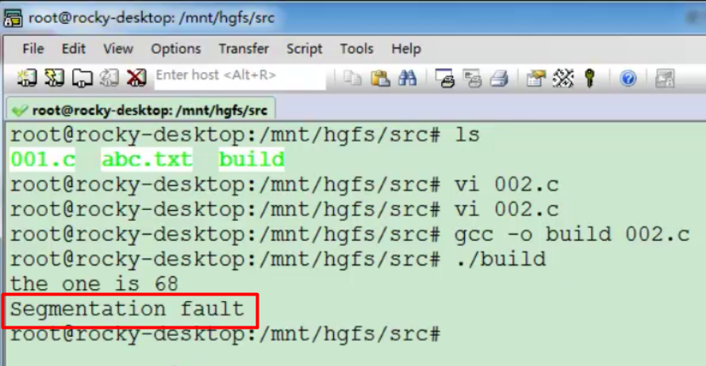
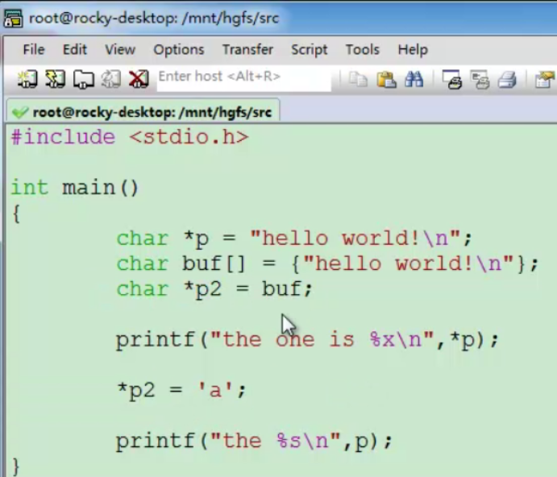
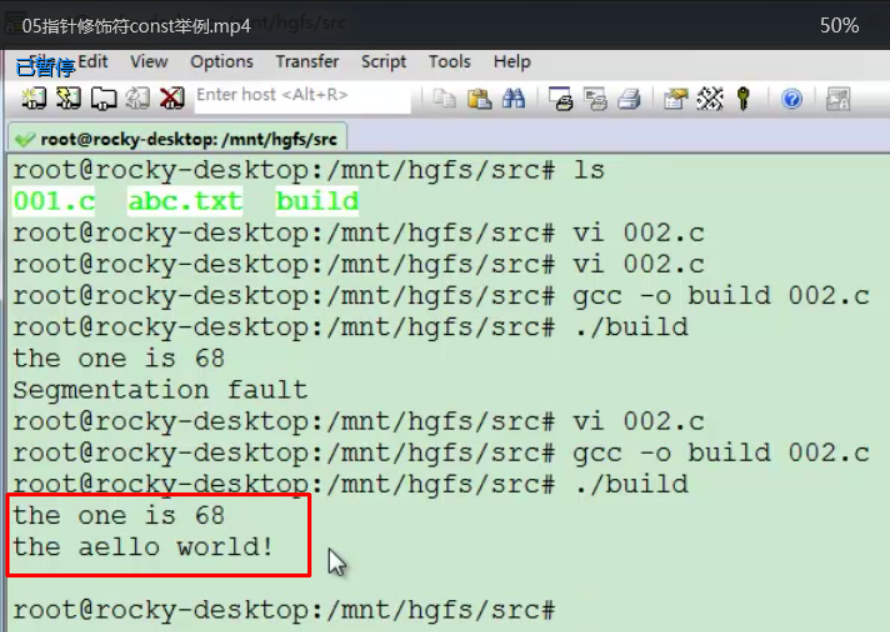
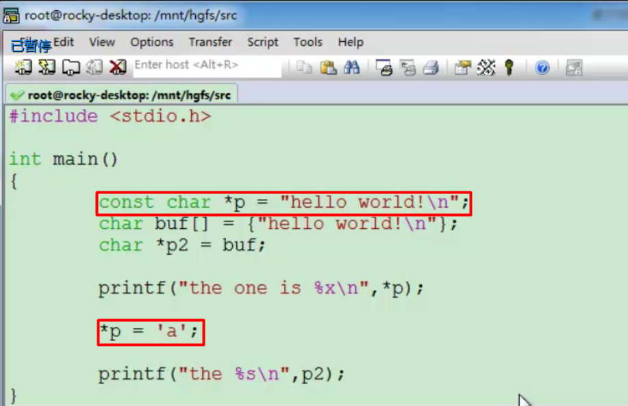
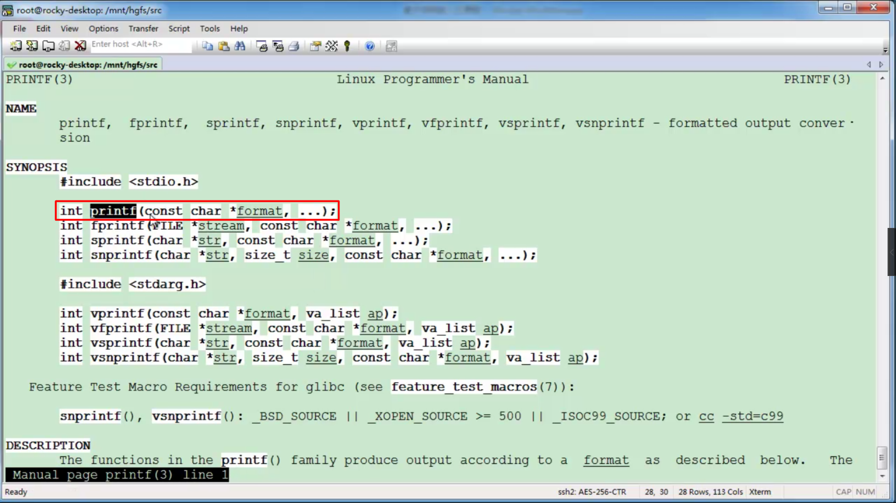

# C语言指针

在本章内容中，我们将给大家展示一下C语言对于内存空间指向和内存空间使用上的一些技巧。在我们上一个阶段中，我们只是明白了C语言给我们带来的关键字和运算符。但是C语言的核心-操作内存资源的方式方法，这些我们没有介绍。在本个学习阶段，我们将重点围绕C语言访问内存空间的方式，以及访问空间需要使用的一些技巧来展开。

## 指针介绍

之前我们曾经说过，C语言操作内存的方式非常简单。CPU通过地址找到我们的内存（内存可以是内存条，显卡，USB等等设备….），内存的资源怎么样被找到？我们需要寻找到我们需要的资源，这就是我们经常在硬件中看到的寻址。通过寻找他的地址，也就是内存的门牌号，我们就可以找到这一片资源，然后才能去使用这里的数据。

这里就有了一个新的概念-地址。在C里面，我们并没有取名一个关键字叫address，也没有这种类型。C里面采用的是指针，利用指针去描述地址的概念。我们访问内存空间就需要依靠指针，找到资源其实就是使用指针去指向它的地址。我们可以理解为指针就是内存类型资源地址、门牌号的代名词。


### 指针的存储

指针指向的是内存资源，但是它自己本身存储在哪？指针只是一个概念，我们要使用这个指针，就应该有一个指针变量。变量就是我们在内存中圈出一块地，然后我们在这块地上面去存储一些东西。变量在内存中实实在在的存在的。

指针变量 ： 存放指针这个概念的盒子。

我们可以举一个例子。比如一个int类型的变量int a;这个红色方框就是我们圈出的一块大小为32bit的地，它存储int变量的值（int变量在各个编译器中有可能被理解为不同的大小）。那么我们该如何去定义指针变量？


为了显示出指针的存储地址的能力与其他变量是不同的，于是就有了一个新的符号\*。\*号如果后面是数值，我们都知道那是乘法的意思。一旦\*号后面跟的是一个合法的标识符，比如*p（指针变量定义名称的时候都喜欢以P_开头，代表pointer），这就是一个变量名为p的指针变量。

C语言编译器对指针这个特殊的概念，有2个疑问？分配一个盒子，盒子要多大？     

内存是一大片的空间，我们就用内存的地址，也就是它的门牌号来查找具体的一小块内存。现在我们的电脑的内存1个G还是很简单的。我们现在需要的是怎么访问这1个G里面的内存的每一个字节。我们应该用什么来描述这些内存呐？

1GB=2^10MB=2^20KB=2^30Byte。所以如果我们希望去描述内存的每一个字节（Byte），如果我们采用整型去依次为这些内存赋一个门牌号，从0开始编号，一个字节就是一个房间，那么1个G的内存需要2^30个数字。我们必须保证内存的所有地址通过指针都是可以访问得到的。在32位操作系统中：两个关于32位的概念。

1）数据的处理就是32位的，高于32位的数据就不能够处理了。

2）CPU操作内存的大小也就是32位的。它只能够操作2^32这么多的内存，2^32Byte=4GB，所以32位操作系统的内存条最大只能4G，再大也没用了。

指针变量也是一个存储地址的变量，存储这个地址需要多大的空间，在32bit系统中，指针就4个字节。

当我们理解了这个概念之后，我们就明白`char *p`或者是`xxx *p`，保存这个指针变量的地址都是4个字节。4个字节就是存放其它内存地址的门牌号，这是一个整型。指针变量将它解释为地址。

盒子里存放的地址 所指向 内存的读取方法是什么？

当我们看到指针的时候，就应该想到它存储的是地址，那么这个地址指向的内存又需要多大？编译器在看到有一个指针变量声明的时候，它就需要知道这个指针变量所指向的空间大小。难道指针指向的空间在我们读取的时候只是读取一个字节吗？那就和char类型一样了。所以指针的定义在于我们不仅要知道数据存储的首地址，还要知道这段内存应该读取多少个字节。

如果我们定义一个`char *p`，编译器首先看到我们声明了一个指针变量`*p`，然后就会发现前面的char类型的大小，就让编译器知道如果我们需要读取这个指针的值内存应该读取一个字节。前面的类型可以有很多，比如int，double，struct等等

### 我们需要对指针有这样的理解

1）指针就是一个地址；

2）指针变量有两个属性，其中第二个属性非常关键，关于内存的读取方法一定要心里有数，不同的内存读取方法还有不同的现象和结果。

### 解释第一个概念：大小一样的盒子存储指针

代码如下

我们声明了两个类型的变量，它们的类型是不同的。我们通过sizeof来查看这两个指针变量的大小。

```c
#include <stdio.h>

int main(){
  	int *p1;
  	char *p2;
  	printf("the p1 is %u, the p2 is %u\n", sizeof(p1), sizeof(p2));
}
```

运行结果如下

```
the p1 is 4, the p2 is 4
```

这是在Ubuntu操作系统下的运行结果，下面两句命令分别是编译命令和运行的命令，可以看到虽然它们的指针指向的类型不一样，但是存储指针的空间是一样的，都是4个字节，指针变量的大小与指向类型无关。

### 解释第二个概念：指针指向的地址读取是与类型有关的

我们申请了一个int类型的变量a并将0x12345678这个数值存储到内存中去了。那我们申请了一个int类型的指针，里面怎么放指针呐？如下图所示可以吗？我们将一个整型0x1122放到本应该存储指针的指针变量中去，这个写法是没有语法错误的。因为0x1122并没有超越2^32，但是在我们看来它是一个整型，当放进去指针变量之后，这个整型就被解释为一个地址，也就是门牌号。那么0x1122这个地址里面对应的资源是什么呐？这个资源是否合法呐？如果我们对一个非法空间进行操作的话，系统就会禁止我们这么做。

```c
#include <stdio.h>

int main(){
  	int a = 0x12345678;
  	char *p1;
  	p1 = 0x1122;
  	printf("the p1 is %u, the p2 is %u\n", sizeof(p1), sizeof(p2));
}
```

所以在指针中，我们还将引入一个新的概念：指针指向的内存空间一定要保证合法性。

合法就是这个内存地址确确实实存在，还要保证它能读能写。

比如我们想通过CPU去控制一个LED灯，这个灯的资源肯定也有一个门牌号，对于这段资源，我们是否能够读取。这个时候我们就不能读取出来，因为他就是一个状态，高低电平的状态。如果寄存器不允许我们读取我们就读取不出来，如果我们向它申请去读，读出来的结果就可能会是随机的，这样的结果就会误导我们。

如果有同学在学习C的时候出现段错误，那么这种段错误百分之九十都是跟指针指向内存的非法性有关。所以出现这个错误的时候，我们第一个就应该去查找代码中的指针，看看指针有没有非法操作。

### 指针赋值

所以我们应该给指针变量一个地址，而不是一个整型或者是其它类型的变量。所以我们介绍一个新的运算符：取址运算符&，它可以对一个变量取地址。

```c
// 将a的首地址赋值给p1，a应该拥有4个字节，
// 它将这4个门牌号中的第一个门牌号（也是门牌号中的最小值）给它
int *p1=&a;
```

### 指针读取

我们声明指针变量之后，C就将变量名看做是一个地址-指针变量存储的地址。p1就是变量名，里面存储的是地址，当我们对p1进行读写的时候，读取的都是地址。所以我们通过*p1来访问它所指向的内存。*p1在这里和变量名a的效果是一样的。我们可以对它进行读写操作。

测试代码和操作代码如下：变量a的写入和读取都是采用十六进制的。

```c
#include <stdio.h>

int main(){
  	int a = 0x12345678;
  	int *p1;
  	p1 = &a;
  	printf("the p1 is %x\n", *p1);
}
```

运行结果

```
the p1 is 12345678
```

在这段代码中，我们声明了一个char类型的指针来存放一个int类型变量的地址，不管int指针变量还是char指针变量存储一个地址都是没有问题的，但是它们的读取方式是不同的，char类型只会读取一个字节的内存，而int类型的会读取4个字节。我们将一个int类型的变量赋值给了char类型的指针，读取这个指针的值的时候按照char类型来读取一个字节，就是存储在指针中的那个字节。那int类型中的四个字节怎么从其中选择一个存储到指针中去呐？

下面的黑色方框中，存储在内存中的内容按照高地址到低地址来存储，int类型的变量如下图所示。而赋值的时候会选取四个字节地址中值小的字节来赋值给指针变量。就将存储0x78的地址给p了。这样的类型不同的赋值是会有警告的，但是依然可以访问。以后我们会介绍怎么消除这条警告。


运行结果如下：可以看到结果确实是将一个字节的内存读取了。

```text
the p1 is 78
```

我们已经在内存中看到了int类型的存储方式，如果我们存储的是0x12，就会在内存中得到二进制的编码0001 0010。如果我们存储一个float类型的1.2，又在内存中又有怎样的存储方式呐？下面我们使用两种方法来读取存储在内存中的float变量。

### 用int类型的指针来读取同样大小的四个字节

测试代码如下

我们可以看到由于不同的指针类型赋值，依然有一个警告。


运行结果如下

这就是浮点数1.2在内存中的存储形式，我们不需要关心这个数从何而来，只需要知道浮点数在内存中表现形式很特殊就行了。


### 用char类型的指针来读取一个字节

测试代码如下


运行结果如下：

以看见读取出来的字符只有最后的9a相同，这里实际上是有一个符号位的问题。我们不应该使用char来读取内存，而应该使用unsigned char来读取内存，后面我们在将内存操作的时候就会解释为什么使用这种方式。


当我们使用unsigned char来读取的时候，就没有了前面符号位的干扰，此时打印的结果就正确了。因为char指针的读取结果可能将某些位当做符号位去读取，打印出来就是错误的了。


在我们了解了指针的基本概念之后，接下来我们来看一下指针和C中给我们提供的关键字中的类型修饰符它们之间的关系。指针就是存储地址的一种特殊变量。那这个变量跟我们的修饰符之间还有哪些更深层次的符号限制呐？我们在实际开发过程中，经常会运用修饰符，把指针的这种限制范围更明确的告诉给用户，通过不同修饰符告诉给用户指针的具体属性。

指针变量也是一个变量，它可以改变存储的地址，指向一个地方再指向另外一个地方；还可以改变指向地址的值；所以它可以有两个地方的改变。为了更好的去修饰一些特殊类型的指针，C提供给了我们三个关键字来修饰指针变量：

### const关键字

Const我们知道他是只读性质的关键字，const修饰的变量就不能改变，成了常量。

1）const char *p；//这两种修饰方法是一样的，我们经常使用这种方法。都是修饰的char字符，它代表的是字符串的内容不可以更改。此时的指针依旧可以指向其它的内存，但是通过指针修改它指向的值就是不可以的了。

```c
char const  *p；
```

2） char * const  p；//这两种修饰方法是一样的，我们经常使用这种方法。都是修饰的指针，它代表的是指针指向的地址不可以改变，而地址里面的内容是可以改变的。

```c
char * p const；
```

一般这种定义都是硬件资源的定义。比如显卡当中有一片缓存，显卡制造的厂家已经为我们焊好了缓存区域，我们如果需要操作这片缓存，我们需要找到缓存的地址，而这些地址是不可以改变的。这个固定地址就可以定义为不可改变地址的指针变量。

3） const char * const p； //指针的指向和指向的内容都不可以被改变。这个一般使用在Rom空间中。

## 指针对常量字符串进行写操作

测试代码如下

首先要知道的是，双引号里面的字符串是常量类型的，在存储字符串的空间中，字符串的每一个字节被展开存储，按照‘h’‘e’‘l’…来存储。我们用char类型的指针指向了这一片区域，严格来说，它们的类型是不匹配的。在前面我们使用\*p来访问变量的值，但是在指向的是字符串的时候，*p代表第一个字节所存储的内容，并修改了这个字符的值。通过p来访问这个字符串全部的内容。



运行结果如下

可以看到第一个字符的内容被显示为h的ASCII码的数值，而修改常量字符串的第一个字符导致了一个我们经常遇到的段错误（显然不是最后输出导致的，如果是输出导致的，将会打印the），这就是指针指向的内容被非法访问导致的段错误。不管你使用声明方法，操作系统都会保证这个空间是不可写的。所以双引号里面的字符串我们应该理解为`const char *`。



### 指针对数组进行写入操作

测试代码如下

由于数组定义的时候就是一个变量，所以我们可以通过指针修改它的值。



运行结果如下

可以看到数组的第一个字符确实被我们修改了。



### 通过指针的修饰符

我们更明确的修饰了内存的属性。

内存属性

1）内存操作的大小：  由指针的类型来决定。

2）内存的变化性，可写可读。

如果内存的实现和我们定义的指针的类型不一样，就很容易导致我们在实际操作中出现一些非法访问的情况，最终出现段错误。所以我们在对指针进行定义的时候，一定要了解指针指向的这片内存真正的属性是什么。如果我们将刚才的字符串常量赋值给一个`const char *p`，显然类型是一样的，此时我们再对它的第一个字符赋值操作的话，编译器就会明确的给我们一个警告而不是段错误了，如下：编译器提示*p是一个只读的值。我们使用char 类型的指针编译的时候没有报错，在运行的时候却会因为段错误而导致程序崩溃，这显然比编译器报错糟糕多了。所以我们赋值的时候应该类型匹配。 




### 在linux系统中，有一个操作手册

我们可以通过下面的命令来查看printf这个函数：


我们可以看到printf这个函数第一个参数为一个常量字符串，所以我们在输出操作的时候都是使用双引号输出。如果你想使用一个非常量的字符指针也是可以的，反正它是不会修改字符的值的。



### 指针越界访问举例

我们都知道const修饰的是一个常量，是不可以被改变的量。但是在C语言中，它也许是一个中看不中用的修饰符。它是希望我们不去改变它的值，但是实际上C却不能阻止我们去修改它。和C++，Java不同，C++中的const就不能被改变。C中就并没有这种强化，当然也有它的道理。下面我们来看一个例子操作一下const常量：

测试代码如下

我们试图去修改一个常量的值。


运行结果如下

由于我们已经定义a为一个int类型的常量，所以我们不能再将一个a作为等式左边的量去修改它的值，这个时候编译器就会提示我们a是一个只读的量。这个时候编译器还会阻止我们去修改它的值。


测试代码如下

p指向的是b的地址，但是由于我们对它进行了一个越界的访问，使它的地址加了4个字节，指向了a的地址。此时我们通过指针对a的值进行修改。


运行结果如下

可以看到a的值被我们改变了。


C中的const告诉我们这只是一个尽量不要去改变的值，告诉编译器在编译的过程中尽量不要改变，但是在运行的时候就没有办法保证，这也可能是C对于底层操作的一个思想。和C++面向对象和应用开发的方式思路不太一样。C面向的是内存，而C++更多的是面向事物，对象之间的关系。