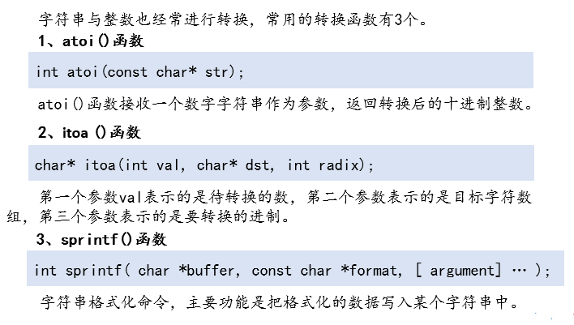
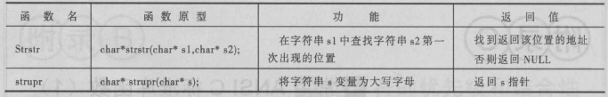
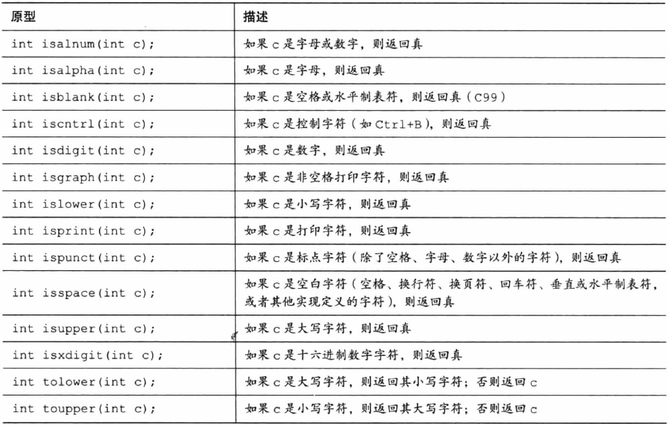
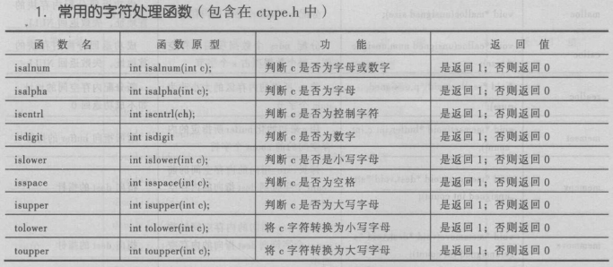

# 标准库函数

## C标准库字符串函数

下面简单介绍一下常用的9个字符串处理函数。

### 1.strlen函数

```c
size_t strlen ( const char * str );
```

求字符串长度函数，用于求C风格的字符串str的长度，size_t即是unsigned int类型。

#### 2.strcpy函数

```c
char * strcpy ( char * destination, const char * source );
```

拷贝字符串函数，将source所指向的字符串拷备到destination所指向的内存空间中。

#### 3.strncpy函数

```c
char * strncpy ( char * destination, const char * source, size_t num );
```

拷贝字符串函数，将source字符串的前num个字符拷备到destination所指向的内存空间中。

#### 4.strcat函数

```c
char * strcat ( char * destination, const char * source );
```

字符串追加函数，将source所指向的字符串追加到destination所指向的字符串的末尾。

```c
#include <stdio.h>
#include <string.h>
void main()
{
	//区号 
	char areaNumber[5];
	//电话号码 
	char phoneNumber[12];
	int input;
	//分机号
	char extraNumber[5];
	//用来存储连接后的结果,需要初始化为0！
	char buffer[25] = {0};
	printf("请输入区号：");
	gets(areaNumber);
	printf("请输入电话号码：");
	gets(phoneNumber);
	printf("有分机号吗？(y/n)");
	input = getchar();
	//由于 getchar() 只读入一个字符，因此需要调用 fflush 来清除输入缓冲区中的换行符  
	fflush(stdin);
	if(input == 'y')
	{
		printf("请输入分机号：");
		gets(extraNumber);
		strcat(buffer, areaNumber);
		strcat(buffer, "-");
		strcat(buffer, phoneNumber);
		strcat(buffer, "-");
		strcat(buffer, extraNumber);
	}
	else
	{
		strcat(buffer, areaNumber);
		strcat(buffer, "-");
		strcat(buffer, phoneNumber);
	}
	printf("您的电话号码是 %s。\n", buffer);
}
```

#### 5.strncat函数

```c
char * strncat ( char * destination, constchar * source, size_t num );
```

字符串追加函数，将source所指向的字符串的前n个字符追加到destination所指向的字符串的末尾。

```c
#include <stdio.h>
#include <string.h>
void main()
{
	char buf1[30];      //声明字符串数组，用于保存字符串buf1
	char buf2[30];      //声明字符串数组，用于保存字符串buf2
	printf("请输入第一个字符串：");
	gets(buf1);          //接收用户输入的字符串
	printf("请输入第二个字符串：");
	gets(buf2);
     //使用strncat()函数来对字符串进行拼接
	strncat(buf1, buf2, sizeof(buf1) - 1 - strlen(buf1));
	printf("连接后的字符串是 %s。\n", buf1);
}
```

#### 6.strcmp函数

```c
int strcmp ( const char * str1, const char * str2 );
```

字符串比较函数，用于比较str1和str2所指向的两个字符串的大小。

```c
#include <stdio.h>
#include <string.h>
void main()
{
	char username[100];  //定义存放用户名的字符数组
	char password[100];  //定义存放密码的字符数组
	printf("登录\n");
	printf("请输入用户名：");
	gets(username);       //获取用户输入的用户名
	printf("请输入密码：");
	gets(password);       // 获取用户输入的密码
	// 比较输入的用户名和密码是否正确
	if (!strcmp(password, "ILoveC") && (!strcmp(username, "user")))
	{
		printf("用户 %s 登录成功！\n", username);
	}
	else
	{
		printf("登录失败，请检查用户名或密码是否正确输入。\n");
	}
}
```

strncmp() 比较两个字符串中的前n个字符是否完全一致

```c
#include <string.h>
#include<stdio.h>
void main()
{
	char* str1="abcdef";
	char* str2="abcdeg";
	//判断字符串str1和str2中的前5个字符是否相同
	if(!strncmp(str1,str2,5))
	{
		printf("str1和str2的前5个字符相同");
	}else
	{
		printf("str1和str2的前5个字符不同");
	}
}
```

#### 7.strchr函数

```c
char * strchr ( char * str, int character );
```

字符查找函数，查找character字符在str字符串中第一次出现的位置。

```c
#include <stdio.h>
#include <string.h>
int getcount(char* str, char c)
{
	//存储找到的字符个数 
	int count = 0;
	//存储当前字符指针在字符串中的位置
	char* ptr = str;
    //获取第一次出现字符变量c值的指针位置
	while((ptr = strchr(ptr, c)) != NULL)
	{
		++ptr;
		++count;
	}
	return count;
}
void main()
{
	char str[6]= "abacad";   
	char c='a';
	count = getcount(str, (char)c);
	printf("字符 %c 在字符串中出现了 %d 次。\n", c, count);	
}
```

strrchr() 查找指定字符在指定字符串中最后一次出现的位置

#### 8.strstr函数

```c
char * strstr ( char * str1, const char * str2 );
```

子串查找函数，查找子字符串str2在字符串str1中第一次出现的位置。

```c
#include <stdio.h>
#include <string.h>
void main()
{
	char str[10240];    //声明字符串数组，用于保存段落
	char word[1024];    //声明字符串数组，用于保存要查找的字符串
	char* ptr;
	printf("请输入要扫描的段落：");
	gets(str);
	printf("请输入要查找的单词：");
	gets(word);
	ptr = strstr(str, word); //搜索是否包含指定的字符串
	if(ptr == NULL)
	{
		printf("段落中不包含单词 %s。\n", word);
	}
	else
	{
		//得到检测出的字符串后20个字符
		if(strlen(ptr) >= 20)
		{
			ptr[20] = 0;
		}
		printf("单词出现在 %s 附近。\n", ptr);
	}
}
```

#### 9.strtok函数

```c
char * strtok ( char * str, const char * delimiters );
```

字符串分割函数，根据delimiters中的字符来分割字符串str。

以上是常用的9个常用的字符串处理函数，这次只做简单的介绍，后续我会继续详细介绍每一个函数并实现这里的每一个函数。

#### 10. atoi函数

将一个数字字符串转换为对应的十进制数

```c
#include <stdio.h>
#include <stdlib.h>
void main()
{
	char buf[20];
	int result;
	printf("请输入待转换的十进制数：");
	gets(buf);
	result = atoi(buf);
	printf("转换结果是 %d。\n", result);
}
```

#### 11. itoa函数

将一个整数转换为字符串

```c
#include <stdio.h>
#include <stdlib.h> 
void main()
{
	char buf[20];
	//用于保存八进制的转换结果 
	char number_8[20];
	//用于保存十进制的转换结果 
	char number_10[20];
	//用于保存十六进制的转换结果
	char number_16[20];
	int val;
	printf("请输入待转换的数：");
	gets(buf);
	val = atoi(buf);    //将输入的字符串表示的数字转换为整型
	//使用 itoa()函数进行转换 
	itoa(val, number_8, 8);
	itoa(val, number_10, 10);
	itoa(val, number_16, 16);
	printf("八进制下为 %s\n", number_8);
	printf("十进制下为 %s\n", number_10);
	printf("十六进制下为 %s\n", number_16);
}
```

#### 12. sprintf()

将一个整数转换为字符串

```c
sprintf(str, "%d", 100);
```



#### myitoa

```c
#include <stdio.h>  
#include <string.h>  
  
void resver(char *s)//反转字符串  
{  
    int len = strlen(s);  
    //printf("len=%d\n",len);  
    int i = 0;  
    char tmp = 0;  
    for (; i<len/2; i++)  
    {  
        tmp = s[i];  
        s[i] = s[len-1-i];  
        s[len-1-i] = tmp;  
    }  
}  
  
const char *myitoa(int n)  
{  
    static char buf[100];//必须为static,或者是全局变量  
    memset(buf, 0, sizeof(buf));  
    int FlagF = 0;    //1-f, 0-z  
    int i = 0;  
    if (n < 0)  
    {  
        FlagF = 1;  
        n = 0 - n;  
    }  
    while (n)  
    {  
        buf[i++] = n % 10 + '0';  
        n = n / 10;  
    }  
    if (FlagF == 1)  
    {  
        buf[i++] = '-';  
    }  
    buf[i] = '\0';  
    printf("before buf:%s\n", buf);  
    resver(buf);  
    printf("after buf:%s\n", buf);  
    return buf;  
}  
  
int main()  
{  
    printf("%s\n", myitoa(123));  
    printf("%s\n", myitoa(-123));  
    return 0;  
}  
```
#### myatoi

```c
#include <stdio.h>  
int mystrlen(const char *s)  
{  
    int i = 0;  
    while (*s++)  
    {  
        i++;  
    }  
    return i;  
}  
int power10(int n)  
{  
    if (n == 0)  
    {  
        return 1;  
    }  
    int val = 1;  
    int i = 0;  
    for (; i < n; i++)  
    {  
        val = val * 10;  
    }  
    return val;  
}  
int char2i(char c)  
{  
    if ((c >= '0') || (c <= '9'))  
    {  
        return (c - '0');  
    } else  
    {  
        return 0;  
    }  
}  
int myatoi(const char *str)  
{  
    int FlagF = 0; //1-f, 0-z  
    const char *p = str;  
    int i = 0;  
    int value = 0;  
    if (str[0] == '-')  
    {  
        FlagF = 1;
        p = ++str;  
    }  
    int len = mystrlen(p);  
    int lentmp = len;  
    for (; i < len; i++)  
    {  
        value += char2i(p[i]) * power10(lentmp - 1);  
        lentmp--;  
    }  
    if (FlagF == 1)  
    {  
        return (0 - value);  
    } else  
    {  
        return value;  
    }  
}  

int main()  
{  
    const char *s = "-123";  
    printf("%d\n", myatoi(s));  
    return 0;  
}  
```

| 函数声明                | 功能描述                          |
| ------------------- | ----------------------------- |
| strcpy()            | 拷贝字符串                         |
| strlen()            | 求字符串长度                        |
| strcat()            | 字符串连接                         |
| strncat()           | 字符串连接，解决缓冲区溢出问题               |
| strcmp()            | 字符串比较                         |
| strncmp()           | 比较两个字符串中前n字符是否完全一致            |
| strstr()            | 子串查找                          |
| strchr              | 字符查找（第一次出现的位置）                |
| strrchr             | 查找指定字符在指定的字符串中最后一次出现的位置       |
| strtok              | 字符串分割                         |
| atoi()              | 将一个数字字符串转换为十进制                |
| itoa()              | 将一个整数转换为不同进制下的字符串，VS提供的函数     |
| sprintf()           | 字符串格式化命令，把格式化的数据写入某个字符串中      |
| strcspn(str1, str2) | 在字符str1中查找，与str2中任意字符有公共交集的位置 |




### 常用的字符处理函数



| 函数声明      | 功能描述     |
| --------- | -------- |
| isspace() | 是否为空格    |
| isalpha() | 是否是字母    |
| isalnum() | 是否是字母或数字 |
| iscntrl() | 是否是控制字符  |
| isdigit() | 是否是数字    |
| islower   | 是否是小写字母  |
| isupper() | 是否是大写字母  |
| tolower() | 转为小写字母   |
| toupper() | 转为大写字母   |


