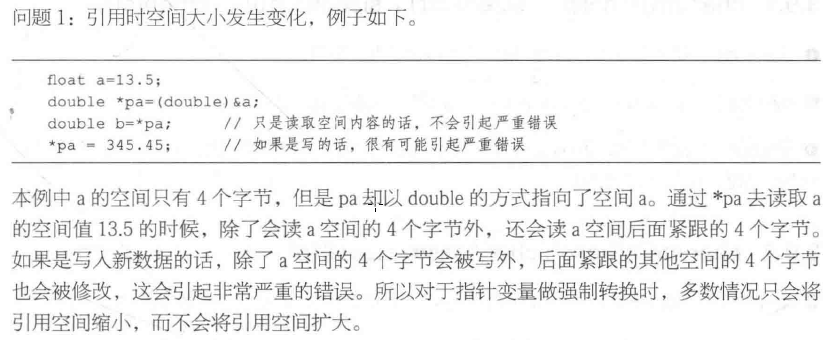
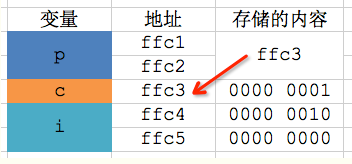
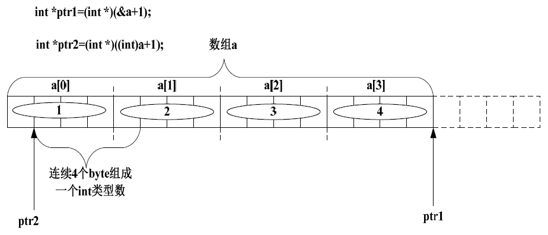

# 强制类型转换

## 指针变量数据类型的强制转换

必须显式强制类型转换，不允许隐式类型转换

- 指向空间的强制类型转换，本质上就是普通变量的强制类型转换

```c
int a = 10;
float b = 3.14;
int *pa = &a;
float *pb = &b;
*pa = (int)*pb; // 等价于 a = (int)b;
```

- 指针本身强制类型转换，改变的是对其指向空间的引用方式（空间大小和存储结构）

```c
int a = 10;
int *pa = &a;
float *pb = NULL;
pb = (float *)pa; // 或者 pb = (float *)&a;
```

将指针pa存放的地址转换为 (float *) 后，赋值给pb。pb里面的地址值与pa里面的地址值是相等的，但是 pa 放的是 (int *) ，而 pb 放的是 (float *) 型。虽然它们指向同一个空间 a ，但不同的是，当使用 *pb 去使用变量空间 a 的时候，会以float型的空间大小和数据存储结构使用a空间的值。

- 指针变量本身强制类型转换需要注意的问题




1.一个指针变量占用多少个字节的内存空间？占用的空间是否会跟随所指向变量的类型而改变？

在同一种编译器环境下，一个指针变量所占用的内存空间是固定的。比如，在16位编译器环境下，任何一个指针变量都只占用2个字节，并不会随所指向变量的类型而改变。

| 数据类型   | 16位编译器 | 32位编译器 | 64位编译器 |
| ------ | ------ | ------ | ------ |
| char   | 1      | 1      | 1      |
| void * | 2      | 4      | 8      |

2.既然每个指针变量所占用的内存空间是一样的，而且存储的都是地址，为何指针变量还要分类型？而且只能指向一种类型的变量？比如指向int类型的指针、指向char类型的指针。

```c
int i = 2;
char c = 1;
char *p = &c;
printf("%d", *p);
```

输出结果是1，如果把第三行代码改成`int *p = &c;`，输出结果是513

原因分析：根据变量的定义顺序，这些变量在内存中大致如下图排布：



其中，指针变量p和int类型变量i各占2个字节，char类型的c占一个字节，p指向c，因此p值就是c的地址

最初的时候，我们用`char *p`指向变量c。当利用 *p 来获取变量c的值时，由于指针p知道变量c是char类型的，所以会从ffc3这个地址开始读取1个字节的数据：0000 0001，转为10进制就是1

后来，我们用`int *p`指向变量c。当利用 *p 获取变量c的值时，由于指针p认为变量c是int类型的，所以会从ffc3这个地址开始读取2个字节的数据：0000 0010 0000 0001，转为10进制就是513

### 地址的强制转换

先看下面这个例子：

```c
struct Test
{
	int Num;
	char *pcName;
  	short sDate;
	char cha[2];
	short sBa[4];
}*p;
```

假设p 的值为0x100000。如下表表达式的值分别为多少？

- p + 0x1 = 0x___ ?
- (unsigned long)p + 0x1 = 0x___?
- (unsigned int*)p + 0x1 = 0x___?

我相信会有很多人一开始没看明白这个问题是什么意思。其实我们再仔细看看，这个知识点似曾相识。一个指针变量与一个整数相加减，到底该怎么解析呢？还记得前面我们的表达式“a+1”与“&a+1”之间的区别吗？其实这里也一样。指针变量与一个整数相加减并不是用指针变量里的地址直接加减这个整数。这个整数的单位不是byte 而是元素的个数。所以：

p + 0x1 的值为0x100000+sizof（Test）*0x1。至于此结构体的大小为20byte，前面的章节已经详细讲解过。所以p +0x1 的值为：0x100014。

(unsigned long)p + 0x1 的值呢？这里涉及到强制转换，将指针变量p 保存的值强制转换成无符号的长整型数。任何数值一旦被强制转换，其类型就改变了。所以这个表达式其实就是一个无符号的长整型数加上另一个整数。所以其值为0x100001。

(unsigned int\*)p + 0x1 的值呢？这里的 p 被强制转换成一个指向无符号整型的指针。所以其值为：0x100000+sizof（unsigned int）\*0x1，等于0x100004。

上面这个问题似乎还没啥技术含量，下面就来个有技术含量的：在x86 系统下，其值为多少？

```c
int main()
{
	int a[4]={1,2,3,4};
	int *ptr1 = (int *)(&a+1);
	int *ptr2 = (int *)((int)a+1);
	printf("%x,%x",ptr1[-1],*ptr2);
	return 0;
}

```


这是我讲课时一个学生问我的题，他在网上看到的，据说难倒了n 个人。我看题之后告诉他，这些人肯定不懂汇编，一个懂汇编的人，这种题实在是小case。下面就来分析分析这个问题：

根据上面的讲解，&a+1 与a+1 的区别已经清楚。

ptr1：将&a+1 的值强制转换成int\*类型，赋值给int\* 类型的变量ptr，ptr1 肯定指到数组a 的下一个int 类型数据了。ptr1[-1]被解析成\*(ptr1-1)，即ptr1 往后退4 个byte。所以其值为0x4。

ptr2：按照上面的讲解，(int)a+1 的值是元素a[0]的第二个字节的地址。然后把这个地址强制转换成int\*类型的值赋给ptr2，也就是说\*ptr2 的值应该为元素a[0]的第二个字节开始的连续4 个byte 的内容。

其内存布局如下图：

