# 计算机系统结构

## 三级存储系统

- cache-主存
- 主存-磁盘
- cache-主存-磁盘

### 物理地址Cache存储系统

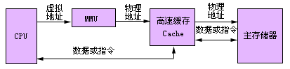

当CPU要访问存储器时，给出一个虚拟地址。由存储管理部件（MMU：Memory Managent Unit）中的地址变换部件把CPU发出的虚拟地址变换成主存物理地址。然后用主存物理地址访问Cache。如果要访问的数据或指令在Cache被找到，则Cache命中，否则，发出Cache块失效，用这个物理地址访问主存储器，取出一块数据或指令装入Cache，同时，也把CPU所需要的数据或指令送往CPU。

### 虚拟地址Cache存储系统

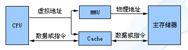

当CPU要访问存储器时，把虚拟地址直接送往存储管理部件MMU和Cache。Cache能够直接接受虚拟地址的访问，把CPU所需要的数据或指令找出来。如果Cache发生块失效，则用经过MMU变换得到的主存物理地址访问主存储器，把读出的一块数据或指令装入到Cache中。同时，也把CPU所需要的数据或指令送入CPU。如Intel公司的i860等处理机采用这种组织方式。

##  存储器

按存储元件分类

- 半导体存储器
- 磁性材料存储器：磁盘和磁带
- 光介质存储器：光盘

按存取方式分类

- 随机存储器RAM（Random Access Memory）
- 只读存储器ROM

## 计算机硬件

不管是台式机还是笔记本，它们内部都有一块电路板，上面密密麻麻地布满了大小不一的电子器件，包括CPU、内存条、网卡、各种插槽和接口等，这就是“主板”，如下图所示。

这张图片主要让读者了解主板的构造，你不必理解图片中各个晦涩的名词。

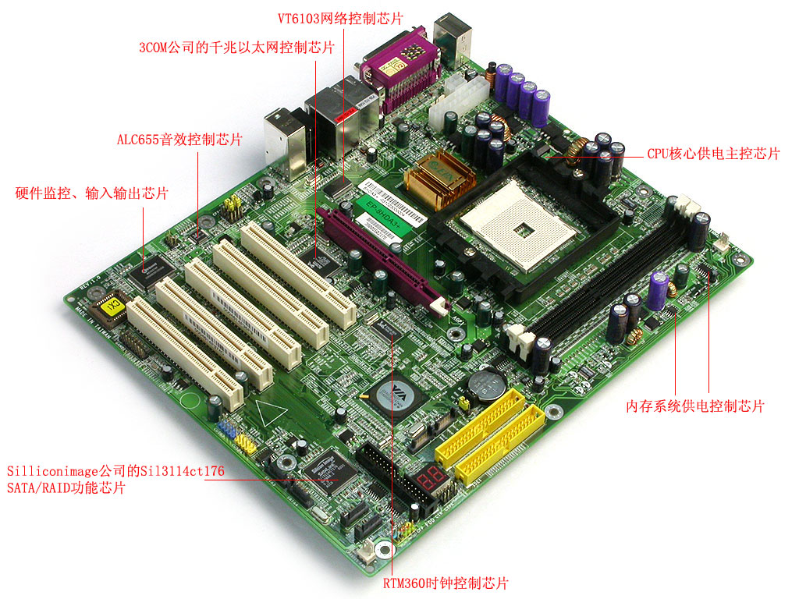

图1：计算机主板CPU

CPU (Central Processing Unit) 就是“中央处理器”，是计算机的大脑，负责计算、思考、处理数据、控制其他设备等，没有CPU，计算机就无从谈起，CPU的速度直接决定了电脑的运行速度。如下图所示：

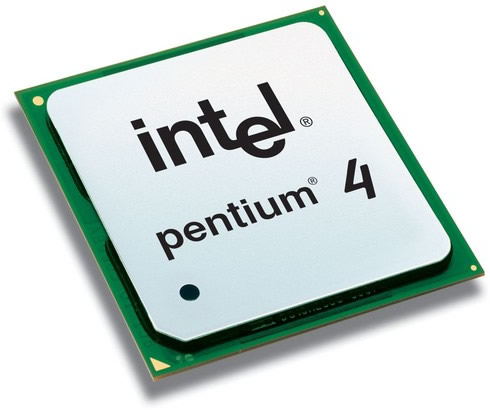
图2：CPU

目前市场上常见的应用于台式机和笔记本的CPU有 Intel(英特尔) 和 AMD(超微半导体公司)，Intel 性能好一点，占据了大部分份额。

关于CPU的位数，我们将在《[C语言和内存](http://c.biancheng.net/cpp/u/c20/)》中的《[虚拟地址空间以及编译模式](http://c.biancheng.net/cpp/html/3188.html)》一节讲解。CPU有很多针脚，直接插在主板上，如下图所示：

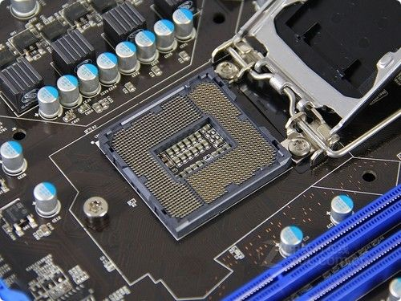

图3：CPU插槽内存内存就是下面的长方形“卡片”，也叫内存条。

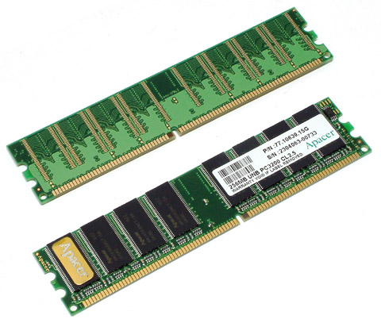
图4：内存条

我们常说电脑有几个G的内存，就是指它的大小，市面上常见的有2G、4G、8G等。

C语言程序必须加载到内存才能运行，CPU 也被设计为只能从内存中读取数据和指令，一名不了解内存的程序员，注定无法彻底理解程序的运行原理，不能让自己的编程水平有一个质的飞越，因此我们特地增加了《[C语言和内存](http://c.biancheng.net/cpp/u/c20/)》专题，让大家彻底明白内存，并运用到实际编程中。内存条插在主板上的特定插槽内，如下所示是台式机的内存插槽：

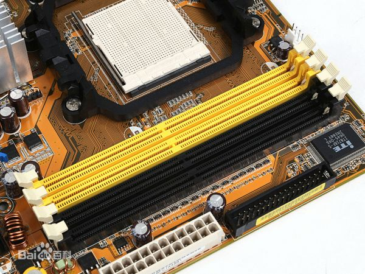

图5：台式机内存插槽

不过笔记本为了节省空间，一般将内存条平放，如下所示：

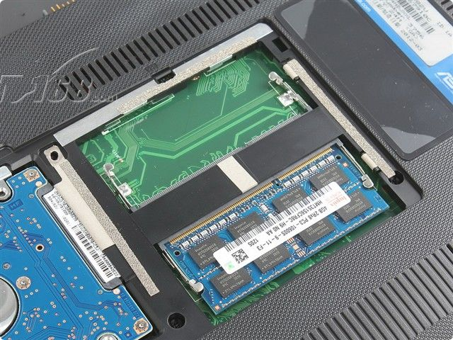

图6：笔记本内存插槽

主板上一般有多个内存插槽，可以插多个内存条，电脑内存大小是所有内存条大小之和。内存条也被称为主存。硬盘硬盘是用来保存数据的。打开一个文件，编辑完成后，Ctrl+S 就保存到了硬盘，断电不会丢失。硬盘分为机械硬盘(HDD)和固态硬盘(SSD)。

机械硬盘就像VCD或DVD，由一个精密电机带动光盘快速转动来让探头读取和写入数据。如下图所示：

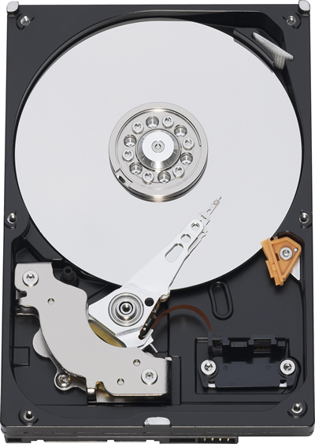

图7：机械硬盘

固态硬盘就像手机内存卡或U盘，内部有上亿个电子元器件，非常细小，达到纳米级别，通过电路来读取和写入数据。如下图所示：

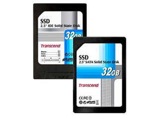
图8：固态硬盘

与机械硬盘相比，固态硬盘在读写速度上有很大优势，一个很明显的例子就是电脑安装了固态硬盘开机速度很快，很少出现卡顿的现象。

硬盘不是直接插在主板上，而是通过导线与主板相连，所以叫外部存储，也是电脑外设的一部分，不过不像鼠标、键盘、U盘等，没有也可以正常工作，硬盘是电脑正常运行所必需的外部设备。协调CPU、内存、硬盘等部件不能各自为战，它们通过主板连接在一起，由CPU控制，协调工作。

## 载入内存，让程序运行起来

如果你的电脑上安装了QQ，你希望和好友聊天，会双击QQ图标，打开QQ软件，输入账号和密码，然后登录就可以了。

那么，QQ是怎么运行起来的呢？

首先，有一点你要明确，你安装的QQ软件是保存在硬盘中的。

双击QQ图标，操作系统就会知道你要运行这个软件，它会在硬盘中找到你安装的QQ软件，将数据（安装的软件本质上就是很多数据的集合）复制到内存。对！就是复制到内存！QQ不是在硬盘中运行的，而是在内存中运行的。

为什么呢？因为内存的读写速度比硬盘快很多。

对于读写速度，内存 > 固态硬盘 > 机械硬盘。机械硬盘是靠电机带动盘片转动来读写数据的，而内存条通过电路来读写数据，电机的转速肯定没有电的传输速度（几乎是光速）快。虽然固态硬盘也是通过电路来读写数据，但是因为与内存的控制方式不一样，速度也不及内存。

所以，不管是运行QQ还是编辑Word文档，都是先将硬盘上的数据复制到内存，才能让CPU来处理，这个过程就叫作载入内存（Load into Memory）。完成这个过程需要一个特殊的程序（软件），这个程序就叫做加载器（Loader）。

CPU直接与内存打交道，它会读取内存中的数据进行处理，并将结果保存到内存。如果需要保存到硬盘，才会将内存中的数据复制到硬盘。

例如，打开Word文档，输入一些文字，虽然我们看到的不一样了，但是硬盘中的文档没有改变，新增的文字暂时保存到了内存，Ctrl+S才会保存到硬盘。因为内存断电后会丢失数据，所以如果你编辑完Word文档忘记保存就关机了，那么你将永远无法找回这些内容。

## 虚拟内存

如果我们运行的程序较多，占用的空间就会超过内存（内存条）容量。例如计算机的内存容量为2G，却运行着10个程序，这10个程序共占用3G的空间，也就意味着需要从硬盘复制 3G 的数据到内存，这显然是不可能的。

操作系统（Operating System，简称 OS）为我们解决了这个问题：当程序运行需要的空间大于内存容量时，会将内存中暂时不用的数据再写回硬盘；需要这些数据时再从硬盘中读取，并将另外一部分不用的数据写入硬盘。这样，硬盘中就会有一部分空间用来存放内存中暂时不用的数据。这一部分空间就叫做虚拟内存（Virtual Memory）。

3G - 2G = 1G，上面的情况需要在硬盘上分配 1G 的虚拟内存。

硬盘的读写速度比内存慢很多，反复交换数据会消耗很多时间，所以如果你的内存太小，会严重影响计算机的运行速度，甚至会出现”卡死“现象，即使CPU强劲，也不会有大的改观。如果经济条件允许，建议将内存升级为 4G，在 win7、win8、win10 下运行软件就会比较流畅了。

关于内存的更多知识，大家在学习完《C语言入门教程》后，请继续阅读《[C语言和内存](http://c.biancheng.net/cpp/u/c20/)》，我敢保证你将会顿悟。

总结：CPU直接从内存中读取数据，处理完成后将结果再写入内存。

图1：CPU、内存、硬盘和主板的关系

## 二进制思想以及数据的存储

**我们平时使用的数字都是由 0~9 共十个数字组成的，例如 1、9、10、297、952 等，一个数字最多能表示九，如果要表示十、十一、二十九、一百等，就需要多个数字组合起来**

例如表示 5+8 的结果，一个数字不够，只能”进位“，用 13 来表示；这时”进一位“相当于十，”进两位“相当于二十。

因为逢十进一，也因为只有 0~9 共十个数字，所以叫做十进制（Decimalism）。

进制也就是进位制。在进行加法（减法）运算时，逢X进（借）一就是X进制，这种进制也就包含X个数字，基数为X。十进制有0~9共10个数字，基数为10，在加减法运算中，逢十进一，借一当十。

我们不妨将思维拓展一下，既然可以用 0~9 共十个数字来表示数值，那么也可以用0、1两个数字来表示数值，这就是二进制（Binary）。

### 二进制思想

二进制只有0和1两个数字，基数为2，在加减法运算中，逢二进一，借一当二。

- 表示数值：0、1、10、111、100、1000001
- 加法：1+0=1、1+1=10、10+110=1000、111+111=1110
- 减法：1-0=1、10-1=1、100-11=1、1010-101=101

十进制与二进制的对应关系

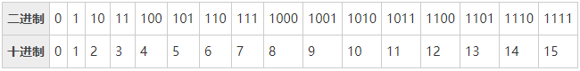

二进制和十进制的转换：

- 十进制 4321 = 4×103 + 3×102 + 2×101 + 1×100
- 二进制 1101 = 1×23 + 1×22 + 0×21 + 1×20 = 8 + 4 + 0 + 1 = 13
- 二进制 110.11 = 1×22 + 1×21 + 0×20 + 1×2-1 + 1×2-2 = 4 + 2 + 0 + 0.5 + 0.25 = 6.75

如果你希望详细了解二进制加减法的运算过程，我们提供了两张示意图。这是选学内容，你完全可以跳过，不会影响后面的学习。

1) 二进制加法：0001 + 0001 = 0010

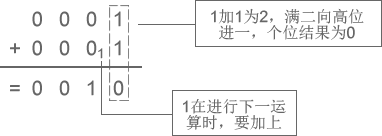

图1：二进制加法

2) 二进制减法：0010 - 0001 = 0001

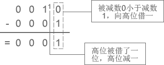

图2：二进制减法

在内存中，数据就是以二进制的形式存储的。内存中数据的存储计算机要处理的信息是多种多样的，如十进制数、文字、符号、图形、音频、视频等，这些信息在人们的眼里是不同的。但对于计算机来说，它们在内存中都是一样的，都是以二进制的形式来表示。

要想学习编程，就必须了解二进制，它是计算机处理数据的基础。

内存条是一个非常精密的部件，包含了上亿个电子元器件，它们很小，达到了纳米级别。这些元器件，实际上就是电路；电路的电压会变化，要么是 0V，要么是 5V，只有这两种电压。5V 是通电，用1来表示，0V 是断电，用0来表示。所以，一个元器件有2种状态，0 或者 1。

我们通过电路来控制这些元器件的通断电，会得到很多0、1的组合。例如，8个元器件有 28=256 种不同的组合，16个元器件有 216=65536 种不同的组合。虽然一个元器件只能表示2个数值，但是多个结合起来就可以表示很多数值了。

我们可以给每一种组合赋予特定的含义，例如，可以分别用 1101000、00011100、11111111、00000000、01010101、10101010 来表示 C、语、言、中、文、网 这几个字，那么结合起来 1101000 00011100 11111111 00000000 01010101 10101010 就表示”C语言中文网“。

一般情况下我们不一个一个的使用元器件，而是将8个元器件看做一个单位，即使表示很小的数，例如 1，也需要8个，也就是 00000001。

1个元器件称为1比特（Bit）或1位，8个元器件称为1字节（Byte），那么16个元器件就是2Byte，32个就是4Byte，以此类推：8×1024个元器件就是1024Byte，简写为1KB；8×1024×1024个元器件就是1024KB，简写为1MB；8×1024×1024×1024个元器件就是1024MB，简写为1GB。
现在，你知道1GB的内存有多少个元器件了吧。我们通常所说的文件大小是多少KB、多少MB，就是这个意思。

单位换算：8 Bit = 1Byte1024Byte = 1KB1024KB = 1MB1024MB = 1GB1024GB = 1TB
你看，在内存中没有abc这样的字符，也没有gif、jpg这样的图片，只有0和1两个数字，计算机也只认识0和1。所以，计算机使用二进制，而不是我们熟悉的十进制，写入内存中的数据，都会被转换成0和1的组合。

我们将在《[C语言调试](http://c.biancheng.net/cpp/u/c23/)》中的《[查看、修改运行时的内存](http://c.biancheng.net/cpp/html/3132.html)》一节教大家如何操作C语言程序的内存。程序员的幽默为了加深印象，最后给大家看个笑话。

程序员A：“哥们儿，最近手头紧，借点钱？”

程序员B：“成啊，要多少？”

程序员A：“一千行不？”

程序员B：“咱俩谁跟谁！给你凑个整，1024，拿去吧。”

你看懂这个笑话了吗？请选出正确答案。

A) 因为他同情程序员A，多给他24块     
B) 这个程序员不会数数，可能是太穷饿晕了       
C) 这个程序员故意的，因为他独裁的老婆规定1024是整数       
D) 就像100是10的整数次方一样，1024是2的整数次方，对于程序员就是整数
