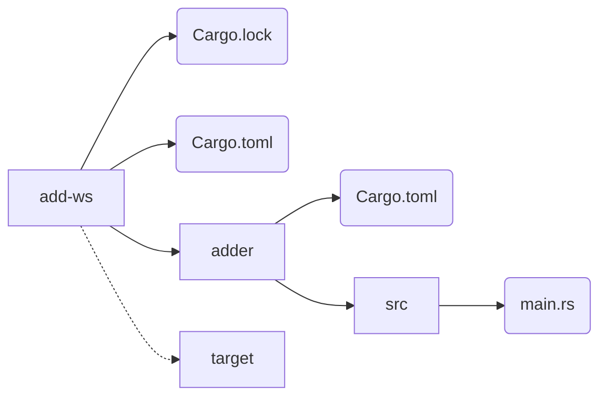
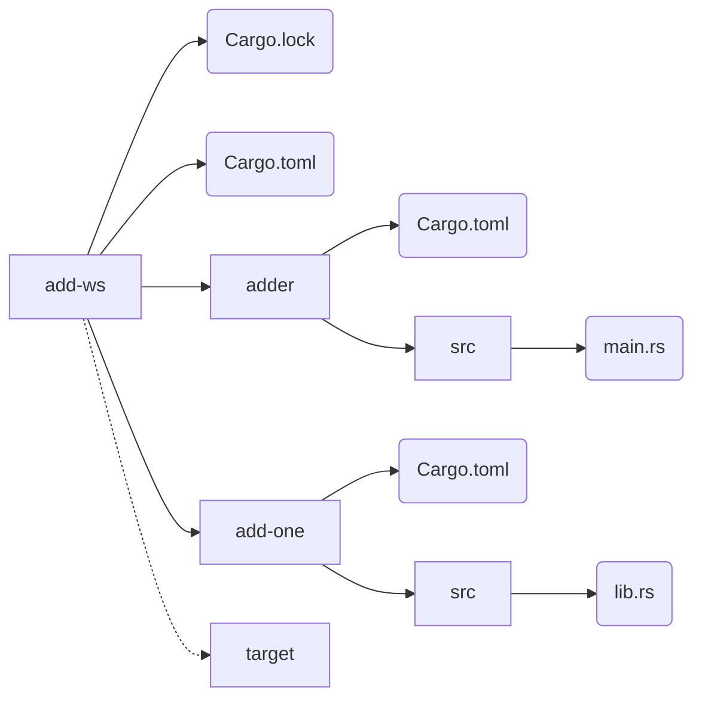

# Cargo 工作空间

*源码：[add-ws](https://gitee.com/A1G2G1/Rust_The_Book/tree/master/add-ws)*


## 前言

在 Chapter12 ，我们创建了一个软件包，包含了 binary crate 和 library crate 。而在项目开发过程中，library crate 可能会变得越来越大，你想将软件包进一步拆分为多个 library crate 。针对这种情况，Cargo 提供了一个特性叫做 ***workspace*** ，它能管理多个相关联的协作开发的软件包。


## 创建 Workspace

何为 workspace ：

- 是一系列软件包的合集
- 这些软件包都共用一个 `Cargo.lock` 
- 这些软件包使用同一个输出目录


下面开始来创建一个 workspace ，包含两个 binary 和两个 library ：

- binary 实现主要功能和逻辑，并依赖于另外两个 library ，crate 名称是 `adder`
- 一个 library 实现了 `add_one` 函数，crate 名称是 `add-one`
- 另一个 library 实现了 `add_two` 函数，crate 名称是 `add-two`
- 整个 workspace 的名称叫 `add-ws`


首先为 workspace 创建目录：

```shell
$ mkdir add-ws
$ cd add-ws
```


然后在 `add-ws` 目录中，添加 `Cargo.toml` 来配置 workspace ：

- 不需要有 `[package]` 、metadata 等信息
- 而是需要 `[workspace]` 来配置该工作空间中有哪些成员
- 因此，需要在 `[workspace]` 中配置各个 crate 的路径

现在先指定 binary crate 的路径：

> add-ws / Cargo.toml

```toml
[workspace]

members = [
    "adder",
]
```


对应的，在 `add-ws` 目录下创建 `adder` 这个 binary crate ：

```shell
$ cargo new adder
```


此时在 `add-ws` 目录上执行 `cargo build` ，则整个目录结构如下：



目录结构说明：

1. 在 `add-ws` 这个 workspace 的根目录下，有 `target` 目录来存放构建结果
2. 对 workspace 中的各个 crate 来说，例如 `adder` ，不会再有自己的 `target` 目录
3. 即使在 `adder` 目录上执行 `cargo build` ，构建结果也是在 `add-ws/target` 中，而不会在 `add-ws/adder/target` 中
4. Cargo 之所以让整个 workspace 共享一个 `target` ，是因为该 workspace 中的各个 crate 是相互依赖的，从而在编译某个 crate 时，不需要考虑同时编译所依赖的其它 crate


## 添加其它 Crate

现在需要为 workspace 添加另一个 library crate ，也就是 `add-one` ，因此，需要在 workspace 的 `Cargo.toml` 中配置对应的路径：

> add-ws / Cargo.toml

```toml
[workspace]

members = [
    "adder",
    "add-one",
]
```


然后创建对应的 `add-one` 这个 library crate ：

```shell
$ cargo new add-one --lib
```


此时整个 workspace 目录结构如下：




接着为该 library crate 添加函数：

> add-ws / add-one / src / lib.rs

```rust
pub fn add_one(x: i32) -> i32 {
    x + 1
}
```


然后让 `adder` 这个 binary crate 依赖和使用 `add-one` 这个 library crate ：

- Cargo 并不知道 workspace 中各个 crate 的相互依赖关系，因此，若 `adder` 依赖和使用了 `add-one` ，则需要在 `adder` 的 `Cargo.toml` 中自行配置该依赖关系
- 依赖配置项位于 `[dependencies]` 中，配置方式是 `add-one = { path = "../add-one" }`
- 要注意的是，其中的 `path` 要注明路径，而不仅仅是 `add-one` 这个名称，因此， `../add-one` 表明位置在上一层目录
- 对应的，在 `adder` 中，使用 `add-one` 之前，需要先 `use`

下面是代码示例：

> add-ws / adder / Cargo.toml

```toml
[dependencies]

add-one = { path = "../add-one" }
```

> add-ws / adder / src / main.rs

```rust
use add_one;

fn main() {
    let num = 10;
    println!("add_one({})={}", num, add_one::add_one(num));
}
```


然后构建整个 workspace ：

- 直接在 `add-ws` 目录上运行 `cargo build`
- 可以看到整个 workspace 中的所有 crate 都进行了构建

```shell
$ cargo build
   Compiling add-one v0.1.0
   Compiling adder v0.1.0
```


最后可以运行程序：

- 直接在 `add-ws` 目录上运行 `cargo run`
- 如果 workspace 中只有一个 binary crate ，则 Cargo 会默认找到并运行它，即 `adder`
- 如果 workspace 中有多个 binary crate ，则需要使用 `-p` 来指定，例如 `cargo run -p adder`

执行示例如下：

```shell
$ cargo run
add_one(10)=11
```

```shell
$ cargo run -p adder
add_one(10)=11
```


## 依赖外部 Crate

注意 workspace 中对各个 crate 的依赖处理：

1. 在整个 workspace 中，只有最外层目录中有一个 `Cargo.lock` ，而在各个 crate 目录中并没有 `Cargo.lock` ，观察上述的目录结构也可以看到这一点
2. 这就确保了对于某个依赖项来说，在整个 workspace 中只会有一个版本，也就是说，各个 crate 使用到的该依赖项属于同一个版本
3. 例如，在 `adder/Cargo.toml` 和 `add-one/Cargo.toml` 中都增加 `rand` 这个 crate ，则 Cargo 会解析为同一个 `rand` 版本并记录在 `Cargo.lock` 中
4. 这个机制保证了 workspace 中的各个 crate 是相互兼容的


例如，为 `add-one` 添加 `rand` 依赖：

> add-ws / add-one / Cargo.toml

```toml
[dependencies]

rand = "0.3.14"
```

同样的，如果 `adder` 中也需要使用 `rand` ，则仍然需要单独添加：

> add-ws / adder / Cargo.toml

```toml
[dependencies]

add-one = { path = "../add-one" }
rand = "0.3.14"
```

然后在 `add-ws` 目录上执行 `Carogo build` ：

```shell
$ cargo build

Downloading rand v0.3.14
Compiling rand v0.3.14
Compiling add-one
Compiling adder
```


再次总结：

1. 在 workspace 中，对于要使用的依赖项，每个 crate 需要自行在对应的 `Cargo.toml` 中添加，某个 crate 使用了依赖项 A ，并不表示另一个 crate 就可以使用该依赖项
2. 即使多个 crate 使用了同一个依赖项，Cargo 最后也会解析为同一个版本的同一个依赖项
3. 即使多个 crate 使用了同一个依赖项，Cargo 也只会下载和构建一次该依赖项
4. 该机制确保了 workspace 中的多个 crate 相互兼容


## 测试和发布

测试规则：

- 在 workspace 上运行 `Cargo test` ，则会测试 workspace 中的所有 crate
- 如果只想测试某个 crate ，则可以使用 `Cargo test -p xxx` 来指定要测试的 crate 名称

发布规则：

- workspace 中的各个 crate 需要分开单独发布
- 因为 `cargo publish` 没有 诸如 `--all` 或 `-p` 等选项
- 所以需要进入各个 crate 目录，单独执行 `cargo publish` 来发布该 crate


例如，为 `add-one` 添加一个测试：

> add-ws / add-one / src / lib.rs

```rust
#[cfg(test)]
mod tests {
	use super::*;

    #[test]
    fn it_works() {
        assert_eq!(6, add_one(5));
    }
}

pub fn add_one(x: i32) -> i32 {
    x + 1
}
```


然后在 workspace 目录上执行 `cargo test` ：

```shell
$ cargo test

Running target/debug/deps/add_one-16176d07b356d257
	running 1 test
	test tests::it_works ... ok

Running target/debug/deps/adder-5042be8a3a766849
	running 0 tests

Doc-tests add-one
	running 0 tests
```

可以看到：

- 先执行 `add-one` 的测试，有 1 个
- 再执行 `adder` 的测试，有 0 个
- 最后是 `add-one` 的 Doc-test


然后使用 `-p` 来指定：

```shell
$ cargo test -p add-one

Running target/debug/deps/add_one-16176d07b356d257
	running 1 test
	test tests::it_works ... ok

Doc-tests add-one
	running 0 tests
```

可以看到：

- 先执行 `add-one` 的测试，有 1 个
- 然后没有执行 `adder` 的测试，因为未被指定
- 最后是 `add-one` 的 Doc-test


## 最后

该 workspace 还有一个 library crate ，也就是 `add-two` ，添加方式与 `add-one` 一致。本文对应的源码中已添加。