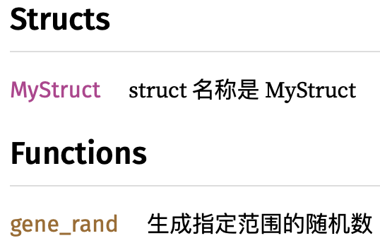
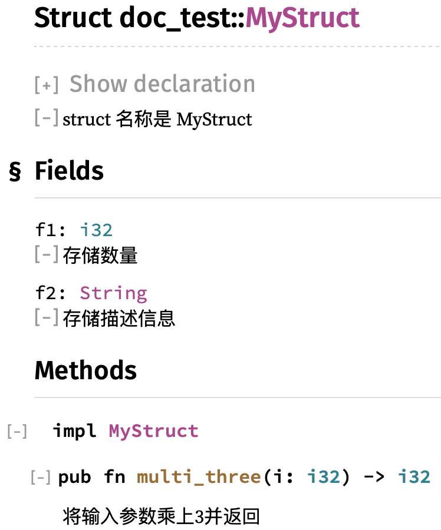
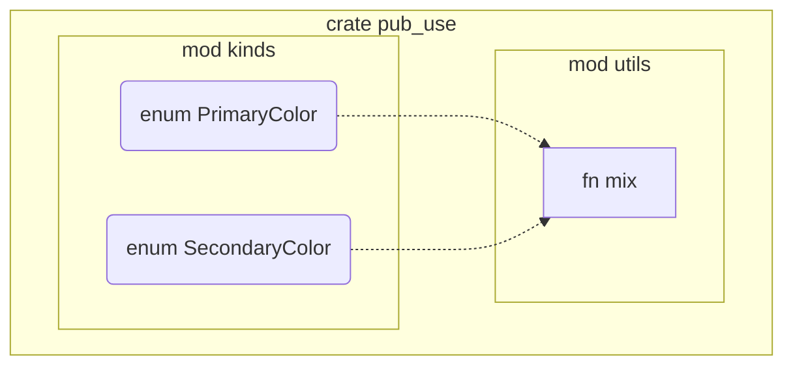

# 发布 Crate

*源码：关于「文档注释」的内容，使用源码 [doc_test](https://gitee.com/A1G2G1/Rust_The_Book/tree/master/doc_test) ，其它内容使用源码 [pub_use](https://gitee.com/A1G2G1/Rust_The_Book/tree/master/pub_use)*

## 前言

在开发过程中，我们经常会使用到 Crate ：

- 在 Project 中，会使用到来自 [Crates.io](https://crates.io) 的依赖
- 而同时，我们使用 [Crates.io](https://crates.io)  来托管开源代码
- 可以将我们的 Crate 发布到  [Crates.io](https://crates.io) ，但需要遵循一些规则

发布 Crate 需要注意这些规则：

1. 良好的文档注释，注意不是代码注释
2. 组织 API ，从而更容易使用和查找

## 文档注释

### 概述

何为文档注释：

- 对于使用者来说，更关心如何使用我们提供的 Crate ，而不是我们的 Crate 如何实现
- 因此，在开发过程中，我们使用 `//` 来进行代码注释；但是，在发布 Crate 时，需要使用文档注释
- 文档注释即 ***documentation comment*** ，对 Crate 进行说明，对应的语法也与代码注释不同
- 总结：开发者看到的是代码注释，而使用者看到的是文档注释

文档注释的语法：

- 文档注释使用 `//!` 或 `///` 开头

- 注释内容使用 MD 语法

文档的生成：

- 文档注释会被用来生成HTML文档
- MD 语法会被转换为 HTML 
- 通过 `cargo doc` 生成文档，路径在 `target/doc` 目录
- 通过 `cargo doc --open` 可以生成文档后直接打开

> 注意：生成的文档会自动包含所依赖的 Crate ，例如本章的源码就使用了 `rand` 这个 Crate ，可以实际测试并查看所生成的文档样式

### `//!`

用途：

- 对 Crate 或 Module 进行注释

- 总体描述该 Crate 或 Module 的功能

位置：

- 对于 Crate ，放在`src/lib.rs` 的顶部
- 对于 Module ，放在 `mod` 内所有 item 之前

> 例如，针对 Crate ，在 `src/lib.rs` 顶部：

```rust
//! doc_test 是我们发布的 crate 名称
```

> 又如，针对 Module ，注意看注释的位置：

```rust
pub mod my_mod {
//! my_mod 是该 module 的名称

}
```

那么，生成的文档如下：


### `///`

用途：

- 注释 item 
- 例如，function ，method ，struct ，struct 中的 filed
- 注意，对于 Crate 和 Module 的注释，一般使用 `//!` ，因为对 Rust 来说，`///` 是针对 item 的注释，而 `//!` 是针对包含一系列 item 的那个 item 进行注释，也就是 Crate 和 Module
- 或者说，`///` 是用来注释一个 item ，而 `//!` 是用来对所包含的 item 进行整体说明

位置：

- 放在要注释的 item 之前

> 例如，对 Crate 中的 `fn` 进行注释

```rust
/// 生成指定范围的随机数
pub fn gene_rand(floor: i32, ceiling: i32) -> i32 {
}
```

> 同时，对 Crate 中的 struct 进行注释

```rust
/// struct 名称是 MyStruct
pub struct MyStruct {
}
```

那么，生成的文档如下：



> 然后，为 struct 的 field 添加注释

```rust
pub struct MyStruct {

	/// 存储数量
	pub f1: i32,

	/// 存储描述信息
	pub f2: String,
}
```

> 再为该 struct 添加方法和注释

```rust
impl MyStruct {

	/// 将输入参数乘上3并返回
	pub fn multi_three(i: i32) -> i32 {
		i * 3
	}
}
```

则针对该 struct ，生成的文档如下：



### 使用 Section

说明：

- 文档注释使用的是 MD 语法
- 因此可以使用诸如 `#` 这样的 MD 标题，也就是 Section
- 使用 Section 的作用是，让生成的文档内容分门别类，表达和阅读得更清晰

常用的 Section ：

- **Examples** ：例子代码，这个涉及到 Doc-tests ，后续再讲
- **Panics** ：说明在哪些情况下可能导致程序 panic
- **Errors** ：如果函数返回值是 `Result` ，则说明有哪些类型的错误，以及在哪些情况下会返回错误
- **Safety** ：如果函数属于 `unsafe` （在 Chapter19 讲解），则进行说明

注意：

- Section 仅仅只是 MD 的语法之一，其作用也仅仅只是影响到生成的 HTML 格式
- 而上述列举的 Section ，是 Rust 开发者约定俗成的

> 例如，可以使用上述 Section ，也可以使用其它 Section

```rust
/// 生成指定范围的随机数
/// 
/// # Panics
/// 说明在哪些情况下会导致panic
/// 
/// # 备注
/// 为了HTML文档的格式，可以自己增加 Section
pub fn gene_rand(floor: i32, ceiling: i32) -> i32 {
}
```

那么生成的文档如下：


### Doc-tests

什么是 `Doc-tests` ：

- 在运行 `cargo test` 时，可以看到 `Doc-tests` 
- 也就是在进行文档注释时，编写的使用示例
- 因此，这些使用示例是文档注释的一部分，但可以在 `cargo test` 时被识别为测试的一部分，即 `Doc-tests`
- 无论是 `///` 或 `//!` ，都可以编写使用示例
- 语法与 MD 一致，在代码的开头和结尾分别使用 \`\`\` 进行标注
- 而对于示例程序，一般作为独立的 Section ，且 Section 名称使用 `# Examples`

例如：

```rust
/// 生成指定范围的随机数
/// 
/// # Panics
/// 说明在哪些情况下会导致panic
/// 
/// # 备注
/// 为了HTML文档的格式，可以自己增加 Section
/// 
/// # Examples
/// 
/// ```
/// let i = doc_test::gene_rand(1, 101);
/// ```
/// 
pub fn gene_rand(floor: i32, ceiling: i32) -> i32 {
	rand::thread_rng().gen_range(floor, ceiling)
}
```

又如：

```rust
pub mod my_mod {
//! my_mod 是该 module 的名称

	/// 将输入参数加1并返回
	/// 
	/// # Examples
	/// 
	/// ```
	/// let i = doc_test::my_mod::add_one(5);
	/// assert_eq!(6, i);
	/// ```
	///
	pub fn add_one(i: i32) -> i32 {
		i + 1
	}
}
```

需要注意的是：

- 对于 `Doc-tests` ，需要访问的 item 都需要从 Crate 前缀开始
- 例如上面的例子，Crate 名称是 `doc_test` ，访问 `add_one` 时，需要写为 `doc_test::my_mod::add_one`

使用 `cargo test` 运行本章的源码，可以看到关于 `Doc-tests` 的输出：

```text
$ cargo test

   Doc-tests doc_test

running 4 tests
test src/lib.rs - gene_rand (line 70) ... ok
test src/lib.rs - MyStruct::multi_three (line 32) ... ok
test src/lib.rs -  (line 5) ... ok
test src/lib.rs - my_mod::add_one (line 49) ... ok

test result: ok. 4 passed; 0 failed; 0 ignored; 0 measured; 0 filtered out
```

## 组织 API

### 概述

关于 ***internal structure*** 和 ***public API*** ：

- 在开发程序时，我们需要组织代码结构，包括使用 Struct 、Module 、Enum 等，这样可以让代码组织清晰，甚至形成很深的层次结构，这叫 ***internal structure***
- 但是在使用时，用户并不关心程序是如何实现的，而是关心如何来使用程序；也就是说，用户只关心有哪些 API 可用，以及如何找到这些 API ，这叫 ***public API***

***internal structure*** 和 ***public API*** 的矛盾：

- 代码的层次结构可以让代码组织清晰，即使是很深的层次结构
- 但是对使用者来说，如果层次过深，则需要 `use` 的路径可能很长，例如 `use my_crate::some_module::another_module::UsefulType;` ，而不是简洁的 `use my_crate::UsefulType;`
- 使用者并不熟悉我们的代码组织结构，因此对于过深的组织层次，会导致用户很难找到所需的某个 API 或 item 
- 另外，代码组织的层次结构仅仅对开发有意义，而对于用户来说是没有意义的，因为用户需要的是有哪些 API 可用，以及如何方便的找到并使用这些 API

### 问题

下面先看一个实际的例子，该例子是从 「The Book」中直接摘抄的，因为很简单，所以没有写注释：

```rust
pub mod kinds {
	pub enum PrimaryColor {
		Red,
		Yellow,
		Blue,
	}
	pub enum SecondaryColor {
		Orange,
		Green,
		Purple,
	}
}

pub mod utils {
	use crate::kinds::*;

	pub fn mix(c1: PrimaryColor, c2: PrimaryColor) -> SecondaryColor {
		SecondaryColor::Green
	}
}
```

则对应的文档如下：


可以看到几个问题：

1. 只能看到最外层的两个 Module
2. 必须点击对应的 Module ，才能逐层的找到内部的 item ，包括 `mix` 函数，还有 `PrimaryColor` 、`SecondaryColor` 等
3. 而对于使用者来说，一旦组织结构太深时，很难看到、也很难找到那些可用的 item
4. 在使用其中某个 API 时，可能该 API 又涉及到其它依赖，例如要使用 `mix` 函数，其实还存在对 `kinds` 这个 Module 中的依赖，但使用者很难在文档中查找到这些依赖

> 比如，对于使用者来说，需要将涉及到 item 都进行 `use` ，该例子涉及到的 item 还不算多，路径也还不算深，依赖关系也还不够复杂：

```rust
use pub_use::kinds::PrimaryColor;
use pub_use::utils::mix;

fn main() {
	let red = PrimaryColor::Red;
	let yellow = PrimaryColor::Yellow;
	mix(red, yellow);
}
```

该例子代码的组织结构和依赖关系如下：



### `pub use`

要解决上述问题，可以使用 ***re-export*** 机制：

- 将使用者关心的 item 重新进行组织，统一移动到一个地方，让用户可以方便的看到，而不用跟随代码组织的层次结构去查找
- 但注意，这并不是重新组织代码，因为代码仍然位置原来的组织结构
- 也就是说，只是针对开发时的代码组织模式，重新构建一个更适合使用者的视图
- 所以，开发时我们构建的是 ***internal structure*** ，而使用者看到的是 ***public API*** 
- 因此，***internal structure*** 是关于开发时的代码组织，***public API*** 是关于使用时的功能展示
- 或者打个不太恰当的比方，***internal structure*** 是数据，***public API*** 是视图
- 但要注意：***re-export*** 只是一种 art ，而不是 science ，因为目的是为了使用者的方便

具体用法：

- 使用 `pub use` ，将使用者关注的那些 ***public API*** 放到代码组织结构的最顶层
- 最顶层其实也就是 `src/lib.rs` 的起始位置
- 这样在生成的文档最顶层，用户就可以看到那些 ***public API*** ，不需要逐层查找

例如，对上面的例子，使用 ***re-export*** 机制，注意路径可以使用 `self::` 前缀：

```rust
pub use self::kinds::PrimaryColor;
pub use self::kinds::SecondaryColor;
pub use self::utils::mix;

pub mod kinds {
    // --snip--
}

pub mod utils {
    // --snip--
}
```

则生成的文档如下：


而对于使用来说，`use` 可以变得更简化，不需要逐层路径了：

```rust
use pub_use::PrimaryColor;
use pub_use::mix;

fn main() {
	// --snip--
}
```

## 开始发布

### 建立账号

- 在 [crates.io](https://crates.io) 上注册账号，最常用的是使用 GitHub 的账号
- 注册成功后，可以得到对应的 API key ，例如 `xxx`
- 然后可以使用该 API key 在 Cargo 命令行中登录
- 登录之后，该 API key 会被存储，存储路径是 `~/.cargo/credentials`

登录方式如下：

```text
$ cargo login xxx
```

### 添加 Metadata

需要为要发布的 Crate 添加 Metadata ：

- Metadata 添加在 `Cargo.toml` 中，Section 是 `[package]`
- 一般常用的 Metadata 有：name/version/authors/edition/description/license ，其它的参见 [Cargo’s documentation](https://doc.rust-lang.org/cargo/)

下面是一个配置例子：

```toml
[package]
name = "pub_use"
version = "0.1.0"
authors = ["Your Name <you@example.com>"]
edition = "2018"
description = "some description"
license = "MIT OR Apache-2.0"
```

关于 `name` ：

- 标识所发布的 Crate 的名称，该名称与具体的 Project 名称无关
- 采用 ***先到先服务*** 的原则，名字是唯一的
- 因此发布之前，可以先在 [crates.io](https://crates.io) 网站上进行查找，若名称已被使用则进行更换，从而确保 `name` 是唯一的

关于 `license` ：

- 在 [Linux Foundation’s Software Package Data Exchange (SPDX)](https://spdx.org/licenses/) 网站上列出了常见的 license
- 如果不在 SPDX 列举的范围内，则可以自己创建 license 文本，并将文件放在 Project 根目录中，然后通过 `license-file` 来设置文件的名字
- 对于 `license` ，支持 `OR` ，例如 `MIT OR Apache-2.0` ，表示使用多个 license
- 一般使用与 Rust 一致的配置，即 `MIT OR Apache-2.0`

### 发布版本

准备好上述事宜之后，可以发布 Crate ，但需要注意：

- Crate 的发布是永久的，也就是说，发布以后的版本永远不会被覆盖，代码永远不会被删除
- 因为 [crates.io](https://crates.io) 的一个主要目标是，所有依赖于 [crates.io](https://crates.io) 的代码，确保永远都能工作及可以被编译，因此发布在 [crates.io](https://crates.io) 的代码都被视为永久的 Archive
- 不限制所发布的版本数量

发布版本的方式是，直接在 Project 上运行命令：

```text
$ cargo publish
```

### 更新版本

在版本有更新时，需要注意：

- 新版本语法需要参考 [Semantic Versioning rules](https://semver.org)
- 目的是：基于本次版本改变的情况，决定应该采用怎样的版本号规则，从而使用者能够更清晰的控制依赖
- 然后，继续使用 `cargo publish` ，即可完成新版本的上传

### 撤回版本

如果发现某个版本存在问题，则可以撤回：

- 所谓的版本撤回，并不是删除该版本，而是限制新的 Project 使用该版本
- 一方面，已有的依赖于该版本的 Project 仍然可以下载和编译
- 一方面，新的项目都不允许依赖于该版本

撤回某个版本的方式：

```text
$ cargo yank --vers 1.0.1
```

对应的，可以恢复撤回：

```text
$ cargo yank --vers 1.0.1 --undo
```

